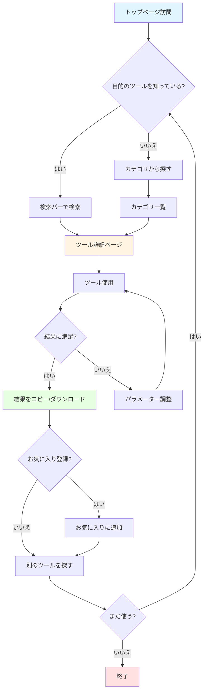
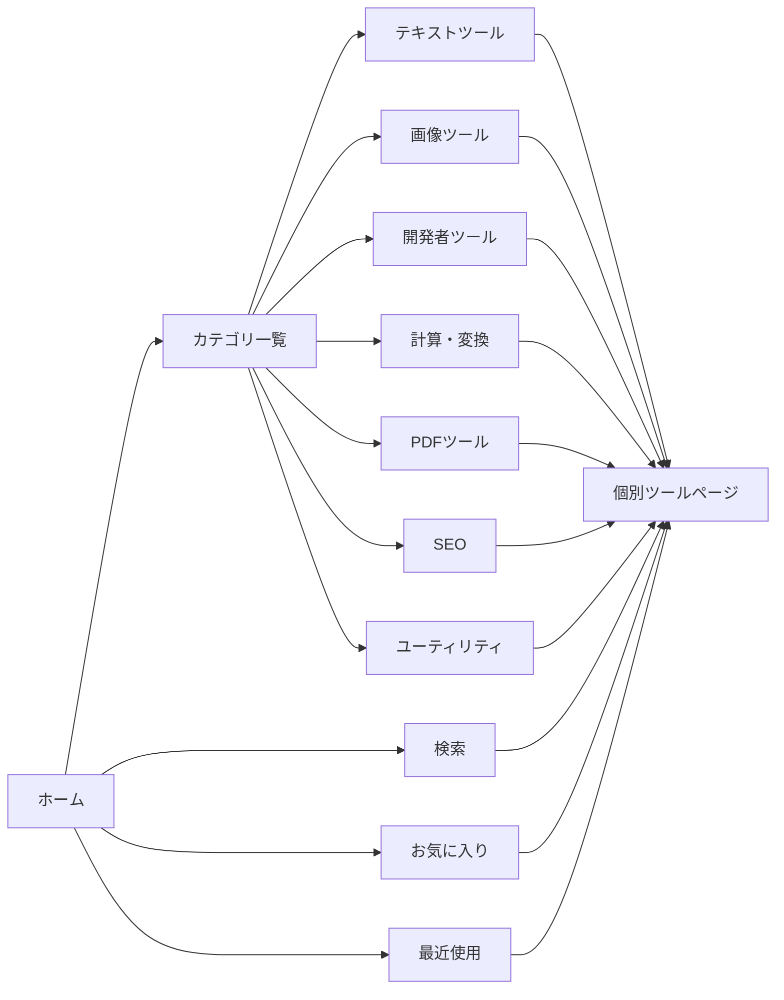
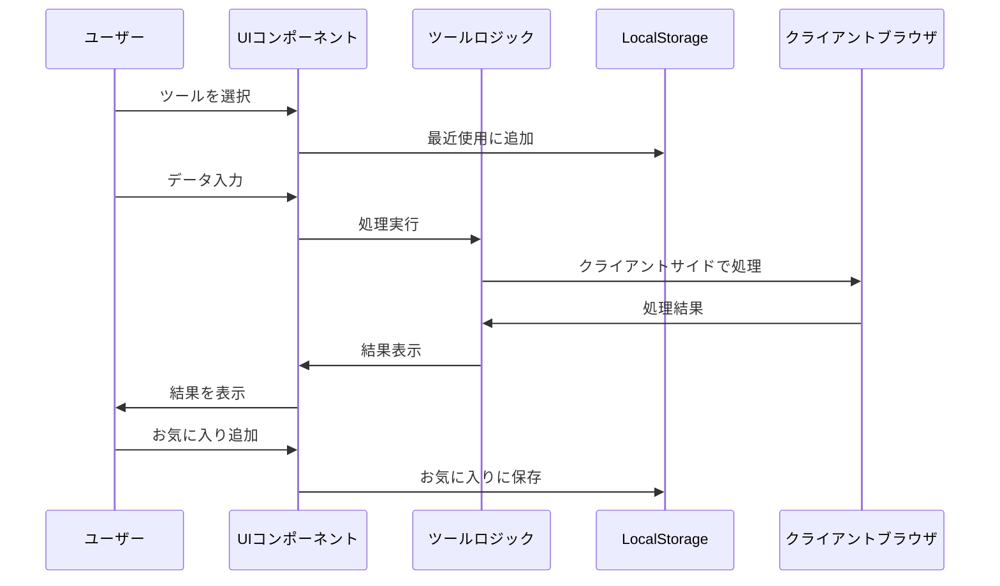

# 機能設計書

## サービス名
**100式道具箱 (100Tools)**

## コンセプト
日本語ファーストの完全無料オンラインツール集。モダンなUI/UXと高速処理で、日常業務から開発まで幅広くサポート。

## MVP方針

### 基本戦略
1. **シンプル・小規模実装**: 個別開発を考慮し、過度な機能は実装しない
2. **クライアントサイド処理優先**: サーバーコストを抑え、プライバシーを重視
3. **差別化は最小限**: 日本語対応とモダンUIに集中
4. **スケーラビリティは後回し**: まずは動くMVPを完成させる

### MVP に含む機能（Must Have）

#### コア機能
- ✅ 110個のツール実装
- ✅ カテゴリ別ツール一覧
- ✅ ツール検索機能（フィルター）
- ✅ レスポンシブデザイン
- ✅ ダークモード対応
- ✅ お気に入り機能（LocalStorage）
- ✅ 最近使ったツール（LocalStorage）

#### 除外機能（Post-MVP）
- ❌ ユーザー認証
- ❌ データベース（初期はLocalStorageで十分）
- ❌ コメント・レビュー機能
- ❌ ツール共有機能
- ❌ API提供
- ❌ アナリティクス（後で追加可能）

## 機能一覧表

### カテゴリ1: テキストツール（20）

| # | ツール名 | 機能概要 | 優先度 | 実装難易度 |
|---|---------|---------|--------|----------|
| 1 | 文字数カウンター | 文字数、単語数、バイト数をリアルタイム表示 | High | Easy |
| 2 | ケース変換 | 大文字/小文字/キャメル/スネーク/ケバブ | High | Easy |
| 3 | Base64エンコーダー | エンコード/デコード | High | Easy |
| 4 | URLエンコーダー | URLエンコード/デコード | High | Easy |
| 5 | HTMLエンティティ | HTMLエンティティ変換 | Medium | Easy |
| 6 | テキスト差分 | 2つのテキストの差分表示 | Medium | Medium |
| 7 | 正規表現テスター | 正規表現のテスト・マッチング | Medium | Medium |
| 8 | JSON整形 | JSON整形・圧縮・バリデーション | High | Easy |
| 9 | XML整形 | XML整形・バリデーション | Low | Medium |
| 10 | Markdown→HTML | Markdownプレビュー | Medium | Medium |
| 11 | テキスト暗号化 | 簡易AES暗号化/復号化 | Low | Medium |
| 12 | パスワード生成 | ランダムパスワード生成（強度設定可） | High | Easy |
| 13 | Lorem Ipsum | ダミーテキスト生成 | Medium | Easy |
| 14 | テキストソート | 行ソート（昇順/降順） | Low | Easy |
| 15 | 重複行削除 | 重複する行を削除 | Low | Easy |
| 16 | 行番号追加 | テキストに行番号を追加 | Low | Easy |
| 17 | テキストリバース | 文字列を反転 | Low | Easy |
| 18 | 空白削除 | スペース・改行・タブ削除 | Medium | Easy |
| 19 | 全角半角変換 | 全角↔半角変換 | High | Easy |
| 20 | ひらがなカタカナ変換 | ひらがな↔カタカナ変換 | High | Easy |

### カテゴリ2: 画像ツール（15）

| # | ツール名 | 機能概要 | 優先度 | 実装難易度 |
|---|---------|---------|--------|----------|
| 21 | 画像形式変換 | JPG/PNG/WebP相互変換 | High | Medium |
| 22 | 画像リサイズ | 指定サイズにリサイズ | High | Medium |
| 23 | 画像圧縮 | 画質を保ちながら圧縮 | High | Medium |
| 24 | 画像トリミング | 任意の範囲を切り取り | Medium | Medium |
| 25 | 画像回転・反転 | 90度回転、左右上下反転 | Medium | Easy |
| 26 | QRコード生成 | テキスト/URLをQRコード化 | High | Easy |
| 27 | QRコードスキャン | 画像からQRコード読み取り | Medium | Medium |
| 28 | カラーピッカー | 画像から色を抽出 | Medium | Easy |
| 29 | グラデーション生成 | CSSグラデーション生成 | Low | Easy |
| 30 | アイコン生成 | テキストからシンプルアイコン生成 | Low | Medium |
| 31 | 画像フィルター | グレースケール、セピア、ぼかし等 | Low | Medium |
| 32 | Base64画像変換 | 画像↔Base64 | Medium | Easy |
| 33 | 画像メタデータ | Exif情報表示 | Low | Medium |
| 34 | プレースホルダー | ダミー画像生成 | Low | Easy |
| 35 | Favicon生成 | 画像からfavicon生成 | Medium | Medium |

### カテゴリ3: 開発者ツール（20）

| # | ツール名 | 機能概要 | 優先度 | 実装難易度 |
|---|---------|---------|--------|----------|
| 36 | JSONフォーマッター | JSON整形・圧縮 | High | Easy |
| 37 | JSON→YAML | JSON to YAML変換 | Medium | Easy |
| 38 | YAML→JSON | YAML to JSON変換 | Medium | Easy |
| 39 | SQL整形 | SQLクエリ整形 | Medium | Medium |
| 40 | JWTデコーダー | JWT解析・検証 | Medium | Easy |
| 41 | ハッシュ生成 | MD5/SHA1/SHA256/SHA512 | High | Easy |
| 42 | UUID生成 | UUID v4生成 | High | Easy |
| 43 | Timestamp変換 | Unix timestamp↔日時 | High | Easy |
| 44 | Cron式生成 | Cron式ビルダー | Low | Medium |
| 45 | カラーコード変換 | HEX/RGB/HSL相互変換 | High | Easy |
| 46 | CSS整形 | CSS整形・圧縮 | Medium | Easy |
| 47 | JavaScript整形 | JS整形・圧縮 | Medium | Easy |
| 48 | HTML整形 | HTML整形・圧縮 | Medium | Easy |
| 49 | コード差分 | コード差分比較 | Low | Medium |
| 50 | Regex生成 | 正規表現ビルダー | Low | Hard |
| 51 | APIテスター | 簡易HTTPリクエストツール | Low | Medium |
| 52 | User Agentパーサー | User Agent解析 | Low | Easy |
| 53 | IP情報 | IPアドレス情報表示 | Low | Easy |
| 54 | Portチェッカー | ポート開放確認（制限あり） | Low | Hard |
| 55 | Whois検索 | ドメイン情報検索（API使用） | Low | Hard |

### カテゴリ4: 計算・変換ツール（20）

| # | ツール名 | 機能概要 | 優先度 | 実装難易度 |
|---|---------|---------|--------|----------|
| 56 | 単位変換 | 長さ/重さ/温度 | High | Easy |
| 57 | 通貨換算 | 為替レート変換（静的レート） | Medium | Easy |
| 58 | パーセント計算 | パーセント計算機 | Medium | Easy |
| 59 | BMI計算 | BMI計算・評価 | Medium | Easy |
| 60 | ローン計算 | 住宅ローン計算 | Low | Easy |
| 61 | 年齢計算 | 生年月日から年齢計算 | Medium | Easy |
| 62 | 日数計算 | 日付間の日数計算 | High | Easy |
| 63 | 時間計算 | 時間の加算・減算 | Medium | Easy |
| 64 | 割引計算 | 割引後価格計算 | Medium | Easy |
| 65 | チップ計算 | チップ金額計算 | Low | Easy |
| 66 | 燃費計算 | 燃費計算機 | Low | Easy |
| 67 | バイト変換 | KB/MB/GB/TB変換 | High | Easy |
| 68 | スピード変換 | km/h ↔ m/s ↔ mph | Low | Easy |
| 69 | 面積計算 | 面積計算機 | Low | Easy |
| 70 | 体積計算 | 体積計算機 | Low | Easy |
| 71 | カロリー計算 | 消費カロリー計算 | Low | Easy |
| 72 | 複利計算 | 複利計算機 | Low | Easy |
| 73 | 税金計算 | 消費税計算 | Medium | Easy |
| 74 | 分数計算 | 分数計算機 | Low | Medium |
| 75 | パーセント変化 | 変化率計算 | Low | Easy |

### カテゴリ5: PDFツール（10）

| # | ツール名 | 機能概要 | 優先度 | 実装難易度 |
|---|---------|---------|--------|----------|
| 76 | PDF→テキスト | PDFからテキスト抽出 | Medium | Hard |
| 77 | PDF→画像 | PDFを画像に変換 | Medium | Hard |
| 78 | 画像→PDF | 画像をPDFに変換 | High | Medium |
| 79 | PDF結合 | 複数PDFを結合 | Medium | Medium |
| 80 | PDF分割 | PDFを分割 | Medium | Medium |
| 81 | PDF圧縮 | PDFファイルサイズ圧縮 | Low | Hard |
| 82 | PDFページ削除 | 特定ページ削除 | Low | Medium |
| 83 | PDFページ回転 | ページ回転 | Low | Medium |
| 84 | PDF暗号化 | パスワード保護 | Low | Medium |
| 85 | PDF復号化 | パスワード解除 | Low | Medium |

### カテゴリ6: SEO・マーケティング（10）

| # | ツール名 | 機能概要 | 優先度 | 実装難易度 |
|---|---------|---------|--------|----------|
| 86 | メタタグ生成 | OGP/Twitterカード生成 | Medium | Easy |
| 87 | OGPプレビュー | OGP画像プレビュー | Medium | Easy |
| 88 | キーワード密度 | キーワード出現率分析 | Low | Easy |
| 89 | 文字数カウンター | SEO用文字数カウント | Medium | Easy |
| 90 | Slugify | URL用スラッグ生成 | Medium | Easy |
| 91 | ドメイン年齢 | ドメイン登録年チェック（API） | Low | Hard |
| 92 | Backlink チェッカー | 被リンク数チェック（API） | Low | Hard |
| 93 | robots.txt生成 | robots.txt生成ツール | Low | Easy |
| 94 | sitemap生成 | sitemap.xml生成 | Low | Medium |
| 95 | UTMビルダー | UTMパラメーター生成 | Medium | Easy |

### カテゴリ7: ユーティリティ（15）

| # | ツール名 | 機能概要 | 優先度 | 実装難易度 |
|---|---------|---------|--------|----------|
| 96 | ストップウォッチ | ストップウォッチ機能 | Medium | Easy |
| 97 | タイマー | カウントダウンタイマー | Medium | Easy |
| 98 | ポモドーロ | ポモドーロタイマー | Medium | Easy |
| 99 | ランダム数字 | 乱数生成器 | Medium | Easy |
| 100 | ランダム文字列 | ランダム文字列生成 | Medium | Easy |
| 101 | サイコロ | サイコロシミュレーター | Low | Easy |
| 102 | コイン投げ | コイン投げシミュレーター | Low | Easy |
| 103 | くじ引き | ランダム抽選ツール | Low | Easy |
| 104 | ビンゴカード | ビンゴカード生成 | Low | Easy |
| 105 | 座席抽選 | 座席ランダム配置 | Low | Easy |
| 106 | チーム分け | グループ分けツール | Medium | Easy |
| 107 | 名前シャッフル | 名前ランダマイザー | Low | Easy |
| 108 | 祝日カレンダー | 日本の祝日表示 | Medium | Easy |
| 109 | 世界時計 | 世界の現在時刻 | Medium | Easy |
| 110 | タイムゾーン変換 | タイムゾーン変換ツール | Medium | Easy |

## 優先順位マトリクス

### フェーズ1（高優先・簡単）: 30ツール
文字数カウンター、ケース変換、Base64、URLエンコーダー、JSON整形、パスワード生成、全角半角、ひらがなカタカナ、QRコード生成、ハッシュ生成、UUID生成、Timestamp変換、カラーコード変換、単位変換、日数計算、バイト変換、税金計算、画像→PDF、メタタグ生成、Slugify、ストップウォッチ、タイマー、ポモドーロ、ランダム数字、ランダム文字列、チーム分け、祝日カレンダー、世界時計、タイムゾーン変換、画像形式変換

### フェーズ2（高優先・中程度）: 25ツール
テキスト差分、正規表現テスター、Markdown→HTML、画像リサイズ、画像圧縮、画像トリミング、QRコードスキャン、JWTデコーダー、JSON↔YAML、BMI計算、年齢計算、PDF結合、PDF分割、OGPプレビュー、UTMビルダー、画像回転・反転、カラーピッカー、Base64画像、Favicon生成、SQL整形、CSS/JS/HTML整形、通貨換算、割引計算、時間計算、キーワード密度

### フェーズ3（中・低優先）: 55ツール
その他全てのツール

## ユーザーフロー



## ナビゲーション構造



## サイトマップ

```mermaid
graph TD
    A[/ トップページ] --> B[/tools テキストツール]
    A --> C[/tools 画像ツール]
    A --> D[/tools 開発者ツール]
    A --> E[/tools 計算・変換]
    A --> F[/tools PDFツール]
    A --> G[/tools SEO]
    A --> H[/tools ユーティリティ]
    A --> I[/favorites お気に入り]
    A --> J[/recent 最近使用]
    A --> K[/about サービス説明]
    A --> L[/privacy プライバシーポリシー]
    A --> M[/terms 利用規約]

    B --> N[/tools/:id 個別ツール]
    C --> N
    D --> N
    E --> N
    F --> N
    G --> N
    H --> N
```

## データフロー



## 技術要件

### パフォーマンス
- 初回読み込み: 3秒以内
- ツール切り替え: 0.5秒以内
- 処理実行: 2秒以内（重い処理はWeb Worker使用）

### ブラウザサポート
- Chrome 90+
- Firefox 88+
- Safari 14+
- Edge 90+

### アクセシビリティ
- WCAG 2.1 AA準拠
- キーボード操作対応
- スクリーンリーダー対応

## MVP実装スコープ調整

### 簡略化する機能
1. **PDF系ツール**: 一部のみ実装（画像→PDF、PDF結合など簡単なもの）
2. **API必要なツール**: スキップまたは静的データ使用（Whois、Backlinkなど）
3. **複雑な画像処理**: 基本機能のみ（高度なフィルターは後回し）

### 完全スキップする機能（Post-MVP）
- ドメイン年齢チェッカー
- Backlink チェッカー
- Portチェッカー
- Whois検索
- Regex生成器（複雑なビルダー）
- PDF圧縮（高度な圧縮）

### 最終的なMVPツール数
**100ツール** (一部の高難易度ツールを除外し、実装可能な範囲で調整)

## 成功指標（Post-Launch）
- 月間アクティブユーザー: 1,000人
- 平均セッション時間: 3分以上
- リピート率: 30%以上
- お気に入り登録率: 10%以上
