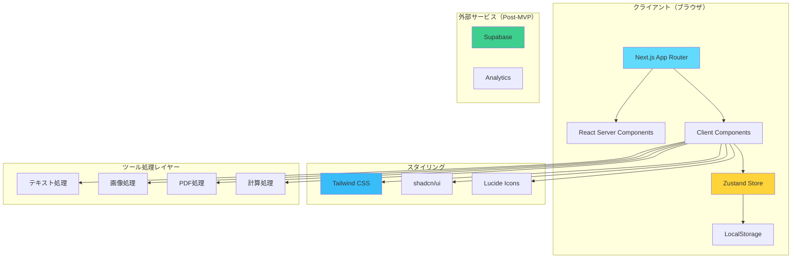

# 技術スタック選定書

## 概要
MVPとして最小限かつモダンな技術スタックを選定。過度な抽象化を避け、シンプルさを重視。

## 制約条件（確定事項）

### フロントエンド
- **フレームワーク**: Next.js 14+ (App Router)
- **言語**: TypeScript (strict mode)
- **スタイリング**: Tailwind CSS
- **デプロイ**: Vercel

## 選定する技術スタック

### 1. コアフレームワーク

#### Next.js 15 (最新安定版)
```json
{
  "next": "^15.0.0",
  "react": "^19.0.0",
  "react-dom": "^19.0.0"
}
```

**選定理由**:
- App Routerで高速なルーティング
- Server Componentsでパフォーマンス最適化
- Vercelとの親和性が高い
- 画像最適化、SEO対策が標準装備

#### TypeScript 5.6+
```json
{
  "typescript": "^5.6.0"
}
```

**設定**:
```json
{
  "compilerOptions": {
    "strict": true,
    "noUncheckedIndexedAccess": true,
    "noImplicitReturns": true
  }
}
```

**選定理由**:
- 型安全性で開発効率向上
- エディタサポートが充実
- バグの早期発見

### 2. スタイリング

#### Tailwind CSS v4
```json
{
  "tailwindcss": "^4.0.0"
}
```

**設定**:
- ダークモード対応
- カスタムカラーパレット
- レスポンシブブレークポイント

**選定理由**:
- 高速な開発
- 一貫性のあるデザイン
- バンドルサイズ最適化
- ダークモード簡単実装

#### shadcn/ui
```bash
npx shadcn-ui@latest init
```

**使用コンポーネント**:
- Button
- Input
- Card
- Dialog
- Tabs
- Toast
- Select
- Switch (ダークモード)

**選定理由**:
- コピペで使える（依存が少ない）
- Tailwindと完全互換
- カスタマイズ性が高い
- アクセシビリティ対応済み

### 3. アイコン

#### Lucide React
```json
{
  "lucide-react": "^0.400.0"
}
```

**選定理由**:
- 1,000+ アイコン
- Tree-shakingでバンドルサイズ最小化
- TypeScript対応
- 統一感のあるデザイン

### 4. 状態管理

#### Zustand
```json
{
  "zustand": "^5.0.0"
}
```

**用途**:
- お気に入り管理
- 最近使用ツール
- ダークモード設定
- 検索フィルター状態

**選定理由**:
- シンプルなAPI
- Reduxより軽量
- TypeScript完全サポート
- LocalStorageとの連携が簡単

**代替案を選ばない理由**:
- ❌ Redux: 過度に複雑（MVP不要）
- ❌ Jotai/Recoil: 学習コストが高い
- ❌ Context API: パフォーマンス問題の可能性

### 5. ツール実装ライブラリ

#### テキスト処理
```json
{
  "js-yaml": "^4.1.0",
  "marked": "^14.0.0",
  "crypto-js": "^4.2.0",
  "html-entities": "^2.5.0"
}
```

- **js-yaml**: YAML ↔ JSON変換
- **marked**: Markdown → HTML
- **crypto-js**: 暗号化、ハッシュ生成
- **html-entities**: HTMLエンティティ変換

#### 画像処理
```json
{
  "browser-image-compression": "^2.0.2",
  "qrcode": "^1.5.4",
  "html5-qrcode": "^2.3.8",
  "sharp": "^0.33.0" (サーバーサイドのみ)
}
```

- **browser-image-compression**: 画像圧縮
- **qrcode**: QRコード生成
- **html5-qrcode**: QRコードスキャン

#### PDF処理
```json
{
  "jspdf": "^2.5.2",
  "pdf-lib": "^1.17.1",
  "pdfjs-dist": "^4.0.0" (プレビュー用)
}
```

- **jspdf**: PDF生成（画像→PDF）
- **pdf-lib**: PDF操作（結合、分割）
- **pdfjs-dist**: PDFプレビュー

#### コード整形
```json
{
  "prettier": "^3.3.0",
  "js-beautify": "^1.15.1",
  "sql-formatter": "^15.0.0"
}
```

- **prettier**: JS/CSS/HTML整形
- **js-beautify**: 軽量コード整形
- **sql-formatter**: SQL整形

#### 日付・時間
```json
{
  "date-fns": "^4.0.0"
}
```

**選定理由**:
- モジュール化されている（tree-shaking）
- momentより軽量
- 日本語ロケール対応

**代替案を選ばない理由**:
- ❌ moment.js: 大きすぎる、非推奨
- ❌ day.js: date-fnsで十分

#### ユーティリティ
```json
{
  "clsx": "^2.1.0",
  "nanoid": "^5.0.0",
  "copy-to-clipboard": "^3.3.3"
}
```

- **clsx**: クラス名結合
- **nanoid**: UUID生成
- **copy-to-clipboard**: クリップボードコピー

### 6. バリデーション

#### Zod
```json
{
  "zod": "^3.23.0"
}
```

**用途**:
- フォーム入力検証
- 環境変数検証
- API型定義

**選定理由**:
- TypeScriptファースト
- 軽量
- エラーメッセージカスタマイズ可能

### 7. データベース（Post-MVP）

**MVP段階**: LocalStorageのみ使用

**Post-MVP（将来的に）**:
```json
{
  "@supabase/supabase-js": "^2.45.0"
}
```

**用途**:
- ユーザー認証
- ツール使用統計
- ユーザー設定の永続化

**選定理由**:
- Vercelと相性良い
- PostgreSQL
- リアルタイム機能
- 認証機能標準装備

### 8. 開発ツール

#### ESLint + Prettier
```json
{
  "eslint": "^9.0.0",
  "eslint-config-next": "^15.0.0",
  "eslint-config-prettier": "^9.1.0",
  "@typescript-eslint/eslint-plugin": "^8.0.0",
  "@typescript-eslint/parser": "^8.0.0"
}
```

#### Husky (Git hooks)
```json
{
  "husky": "^9.0.0",
  "lint-staged": "^15.2.0"
}
```

**用途**:
- コミット前にlint/format自動実行
- コード品質維持

## アーキテクチャ図



## ディレクトリ構造

```
supertools/
├── app/
│   ├── layout.tsx           # ルートレイアウト
│   ├── page.tsx             # トップページ
│   ├── tools/
│   │   ├── [category]/
│   │   │   └── page.tsx     # カテゴリページ
│   │   └── [category]/[id]/
│   │       └── page.tsx     # 個別ツールページ
│   ├── favorites/
│   │   └── page.tsx         # お気に入りページ
│   ├── recent/
│   │   └── page.tsx         # 最近使用ページ
│   └── api/                 # API Routes（必要に応じて）
│
├── components/
│   ├── ui/                  # shadcn/ui コンポーネント
│   ├── layout/              # レイアウトコンポーネント
│   │   ├── Header.tsx
│   │   ├── Footer.tsx
│   │   └── Navigation.tsx
│   ├── tools/               # ツール共通コンポーネント
│   │   ├── ToolCard.tsx
│   │   ├── ToolSearch.tsx
│   │   ├── CategoryFilter.tsx
│   │   └── ToolLayout.tsx
│   └── features/            # 各ツールの実装
│       ├── text/
│       ├── image/
│       ├── dev/
│       ├── calc/
│       ├── pdf/
│       ├── seo/
│       └── utility/
│
├── lib/
│   ├── tools/               # ツールロジック
│   │   ├── text/
│   │   ├── image/
│   │   └── ...
│   ├── utils/               # ユーティリティ関数
│   ├── constants/           # 定数定義
│   │   └── tools.ts         # ツール一覧データ
│   └── store/               # Zustand store
│       ├── favorites.ts
│       ├── recent.ts
│       └── settings.ts
│
├── types/
│   ├── tools.ts             # ツール型定義
│   └── index.ts
│
├── public/
│   ├── images/
│   └── icons/
│
├── styles/
│   └── globals.css          # グローバルスタイル
│
├── docs/                    # ドキュメント
├── .env.example             # 環境変数例
├── .eslintrc.json           # ESLint設定
├── .prettierrc              # Prettier設定
├── next.config.js           # Next.js設定
├── tailwind.config.ts       # Tailwind設定
├── tsconfig.json            # TypeScript設定
└── package.json
```

## パフォーマンス最適化戦略

### 1. コード分割
- 各ツールは動的インポート
- カテゴリごとにコード分割
- 重いライブラリは遅延ロード

```typescript
const HeavyTool = dynamic(() => import('@/components/features/pdf/PDFMerger'), {
  loading: () => <Skeleton />,
  ssr: false
})
```

### 2. 画像最適化
- Next.js Imageコンポーネント使用
- WebP形式優先
- 遅延ロード

### 3. クライアントサイド処理
- Web Worker活用（重い処理）
- すべてブラウザ内で完結
- サーバーアップロード不要

### 4. キャッシング
- LocalStorageで最近使用ツール
- お気に入りツール
- ユーザー設定

## セキュリティ対策

### 1. XSS対策
- DOMPurifyでサニタイズ（必要に応じて）
- React自動エスケープ活用

### 2. CSRF対策
- Next.js標準機能活用

### 3. プライバシー
- すべてクライアントサイド処理
- ファイルアップロードなし（ブラウザメモリのみ）
- トラッキング最小限

## 環境変数

```bash
# .env.example
NEXT_PUBLIC_APP_NAME="100式道具箱"
NEXT_PUBLIC_APP_URL="https://100tools.vercel.app"

# Post-MVP
# NEXT_PUBLIC_SUPABASE_URL=
# NEXT_PUBLIC_SUPABASE_ANON_KEY=
```

## 依存関係まとめ

### production dependencies
```json
{
  "next": "^15.0.0",
  "react": "^19.0.0",
  "react-dom": "^19.0.0",
  "tailwindcss": "^4.0.0",
  "zustand": "^5.0.0",
  "lucide-react": "^0.400.0",
  "date-fns": "^4.0.0",
  "zod": "^3.23.0",
  "clsx": "^2.1.0",
  "nanoid": "^5.0.0",
  "copy-to-clipboard": "^3.3.3",
  "js-yaml": "^4.1.0",
  "marked": "^14.0.0",
  "crypto-js": "^4.2.0",
  "html-entities": "^2.5.0",
  "browser-image-compression": "^2.0.2",
  "qrcode": "^1.5.4",
  "html5-qrcode": "^2.3.8",
  "jspdf": "^2.5.2",
  "pdf-lib": "^1.17.1",
  "prettier": "^3.3.0",
  "js-beautify": "^1.15.1",
  "sql-formatter": "^15.0.0"
}
```

### devDependencies
```json
{
  "typescript": "^5.6.0",
  "@types/node": "^22.0.0",
  "@types/react": "^19.0.0",
  "@types/react-dom": "^19.0.0",
  "eslint": "^9.0.0",
  "eslint-config-next": "^15.0.0",
  "eslint-config-prettier": "^9.1.0",
  "@typescript-eslint/eslint-plugin": "^8.0.0",
  "@typescript-eslint/parser": "^8.0.0",
  "husky": "^9.0.0",
  "lint-staged": "^15.2.0",
  "autoprefixer": "^10.4.20",
  "postcss": "^8.4.47"
}
```

## 選定しない技術とその理由

### ❌ GraphQL
- MVPには過剰
- REST APIも不要（クライアント完結）

### ❌ tRPC
- バックエンドAPI不要（MVP段階）

### ❌ Prisma
- DB使わない（LocalStorageのみ）

### ❌ Redux
- 状態管理が複雑すぎる
- Zustandで十分

### ❌ Styled Components / Emotion
- Tailwindで十分
- バンドルサイズ増加

### ❌ Framer Motion
- アニメーションは最小限
- CSS Transitionで十分（MVP）

## まとめ

**選定方針**:
1. ✅ シンプルさ優先
2. ✅ 学習コスト低い
3. ✅ バンドルサイズ最小化
4. ✅ TypeScript完全対応
5. ✅ 保守性高い

**期待される効果**:
- 開発スピード向上
- パフォーマンス最適化
- メンテナンス性向上
- スケーラビリティ確保（将来）
