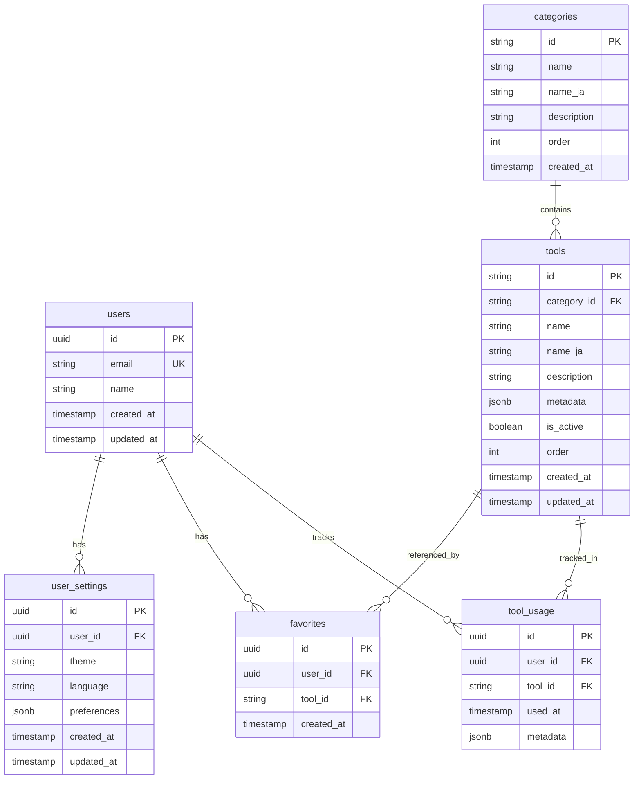
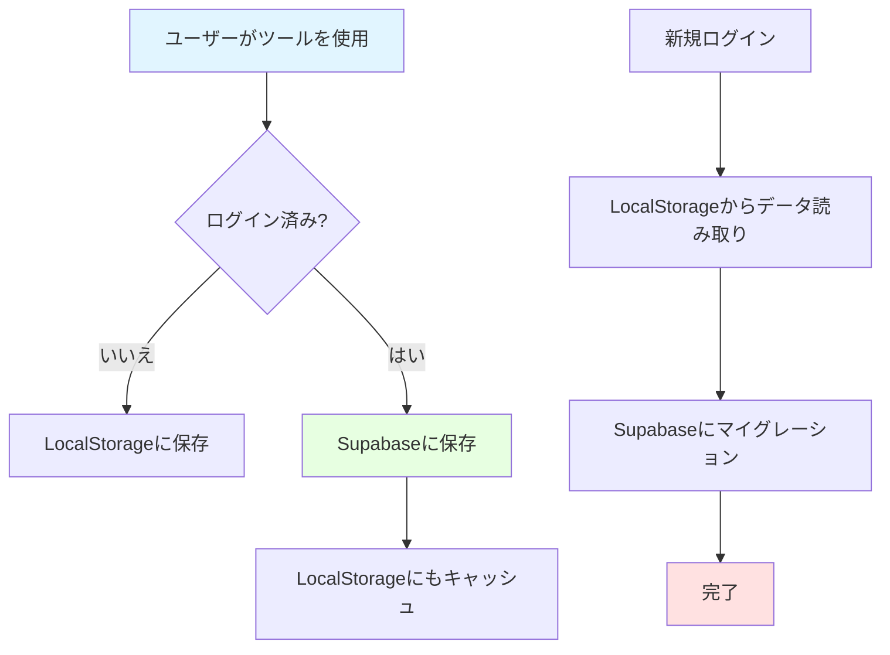

# データベース設計

## MVP方針

### 現状のアプローチ
**MVP段階ではデータベースを使用せず、LocalStorageのみで実装**

理由:
1. ✅ サーバーコスト不要
2. ✅ インフラ管理不要
3. ✅ プライバシー重視（データがサーバーに残らない）
4. ✅ 開発速度優先
5. ✅ 個人開発規模に適している

### LocalStorage設計

#### 1. お気に入りツール
```typescript
// Key: 'favorites'
interface FavoritesData {
  toolIds: string[]  // ツールID配列
  updatedAt: string  // 最終更新日時
}

// Example
{
  "toolIds": ["text-counter", "qr-generator", "json-formatter"],
  "updatedAt": "2025-11-19T12:00:00Z"
}
```

#### 2. 最近使用ツール
```typescript
// Key: 'recent_tools'
interface RecentTool {
  id: string         // ツールID
  name: string       // ツール名
  category: string   // カテゴリ
  usedAt: string     // 使用日時
}

interface RecentToolsData {
  tools: RecentTool[]  // 最大20件
  updatedAt: string
}

// Example
{
  "tools": [
    {
      "id": "text-counter",
      "name": "文字数カウンター",
      "category": "text",
      "usedAt": "2025-11-19T12:00:00Z"
    }
  ],
  "updatedAt": "2025-11-19T12:00:00Z"
}
```

#### 3. ユーザー設定
```typescript
// Key: 'user_settings'
interface UserSettings {
  theme: 'light' | 'dark' | 'system'  // テーマ設定
  language: 'ja' | 'en'               // 言語設定
  defaultCategory?: string            // デフォルトカテゴリ
  showTutorial: boolean               // チュートリアル表示
  updatedAt: string
}

// Example
{
  "theme": "dark",
  "language": "ja",
  "showTutorial": false,
  "updatedAt": "2025-11-19T12:00:00Z"
}
```

#### 4. ツール固有の設定
```typescript
// Key: 'tool_settings_{toolId}'
interface ToolSettings {
  [key: string]: any  // ツール固有の設定
  updatedAt: string
}

// Example: パスワード生成器の設定
// Key: 'tool_settings_password-generator'
{
  "length": 16,
  "includeUppercase": true,
  "includeLowercase": true,
  "includeNumbers": true,
  "includeSymbols": true,
  "updatedAt": "2025-11-19T12:00:00Z"
}
```

### LocalStorageユーティリティ

```typescript
// lib/utils/localStorage.ts
export const storage = {
  get: <T>(key: string, defaultValue: T): T => {
    if (typeof window === 'undefined') return defaultValue
    try {
      const item = window.localStorage.getItem(key)
      return item ? JSON.parse(item) : defaultValue
    } catch (error) {
      console.error('LocalStorage get error:', error)
      return defaultValue
    }
  },

  set: <T>(key: string, value: T): void => {
    if (typeof window === 'undefined') return
    try {
      window.localStorage.setItem(key, JSON.stringify(value))
    } catch (error) {
      console.error('LocalStorage set error:', error)
    }
  },

  remove: (key: string): void => {
    if (typeof window === 'undefined') return
    try {
      window.localStorage.removeItem(key)
    } catch (error) {
      console.error('LocalStorage remove error:', error)
    }
  },

  clear: (): void => {
    if (typeof window === 'undefined') return
    try {
      window.localStorage.clear()
    } catch (error) {
      console.error('LocalStorage clear error:', error)
    }
  }
}
```

---

## Post-MVP: Supabase スキーマ設計

将来的にユーザー認証や統計機能を追加する場合のスキーマ設計。

### ER図



### テーブル定義

#### 1. users（ユーザー）
```sql
CREATE TABLE users (
  id UUID PRIMARY KEY DEFAULT gen_random_uuid(),
  email TEXT UNIQUE NOT NULL,
  name TEXT,
  created_at TIMESTAMPTZ DEFAULT NOW(),
  updated_at TIMESTAMPTZ DEFAULT NOW()
);

CREATE INDEX idx_users_email ON users(email);
```

#### 2. categories（カテゴリ）
```sql
CREATE TABLE categories (
  id TEXT PRIMARY KEY,
  name TEXT NOT NULL,
  name_ja TEXT NOT NULL,
  description TEXT,
  "order" INTEGER NOT NULL DEFAULT 0,
  created_at TIMESTAMPTZ DEFAULT NOW()
);

-- 初期データ
INSERT INTO categories (id, name, name_ja, description, "order") VALUES
  ('text', 'Text Tools', 'テキストツール', 'Text processing and conversion tools', 1),
  ('image', 'Image Tools', '画像ツール', 'Image editing and conversion tools', 2),
  ('dev', 'Developer Tools', '開発者ツール', 'Tools for developers', 3),
  ('calc', 'Calculators', '計算・変換', 'Various calculators and converters', 4),
  ('pdf', 'PDF Tools', 'PDFツール', 'PDF manipulation tools', 5),
  ('seo', 'SEO Tools', 'SEOツール', 'SEO and marketing tools', 6),
  ('utility', 'Utilities', 'ユーティリティ', 'Miscellaneous utility tools', 7);
```

#### 3. tools（ツール）
```sql
CREATE TABLE tools (
  id TEXT PRIMARY KEY,
  category_id TEXT NOT NULL REFERENCES categories(id),
  name TEXT NOT NULL,
  name_ja TEXT NOT NULL,
  description TEXT,
  metadata JSONB DEFAULT '{}',
  is_active BOOLEAN DEFAULT TRUE,
  "order" INTEGER NOT NULL DEFAULT 0,
  created_at TIMESTAMPTZ DEFAULT NOW(),
  updated_at TIMESTAMPTZ DEFAULT NOW()
);

CREATE INDEX idx_tools_category ON tools(category_id);
CREATE INDEX idx_tools_active ON tools(is_active);
CREATE INDEX idx_tools_order ON tools("order");

-- metadata例:
-- {
--   "tags": ["text", "conversion"],
--   "difficulty": "easy",
--   "popularity": 100,
--   "keywords": ["case", "upper", "lower"]
-- }
```

#### 4. user_settings（ユーザー設定）
```sql
CREATE TABLE user_settings (
  id UUID PRIMARY KEY DEFAULT gen_random_uuid(),
  user_id UUID NOT NULL REFERENCES users(id) ON DELETE CASCADE,
  theme TEXT DEFAULT 'system' CHECK (theme IN ('light', 'dark', 'system')),
  language TEXT DEFAULT 'ja' CHECK (language IN ('ja', 'en')),
  preferences JSONB DEFAULT '{}',
  created_at TIMESTAMPTZ DEFAULT NOW(),
  updated_at TIMESTAMPTZ DEFAULT NOW(),
  UNIQUE(user_id)
);

CREATE INDEX idx_user_settings_user ON user_settings(user_id);
```

#### 5. favorites（お気に入り）
```sql
CREATE TABLE favorites (
  id UUID PRIMARY KEY DEFAULT gen_random_uuid(),
  user_id UUID NOT NULL REFERENCES users(id) ON DELETE CASCADE,
  tool_id TEXT NOT NULL REFERENCES tools(id) ON DELETE CASCADE,
  created_at TIMESTAMPTZ DEFAULT NOW(),
  UNIQUE(user_id, tool_id)
);

CREATE INDEX idx_favorites_user ON favorites(user_id);
CREATE INDEX idx_favorites_tool ON favorites(tool_id);
CREATE INDEX idx_favorites_created ON favorites(created_at DESC);
```

#### 6. tool_usage（ツール使用履歴）
```sql
CREATE TABLE tool_usage (
  id UUID PRIMARY KEY DEFAULT gen_random_uuid(),
  user_id UUID REFERENCES users(id) ON DELETE SET NULL,  -- NULL許可（匿名利用）
  tool_id TEXT NOT NULL REFERENCES tools(id) ON DELETE CASCADE,
  used_at TIMESTAMPTZ DEFAULT NOW(),
  metadata JSONB DEFAULT '{}'
);

CREATE INDEX idx_tool_usage_user ON tool_usage(user_id);
CREATE INDEX idx_tool_usage_tool ON tool_usage(tool_id);
CREATE INDEX idx_tool_usage_used_at ON tool_usage(used_at DESC);

-- metadata例:
-- {
--   "browser": "Chrome",
--   "os": "Windows",
--   "duration": 1500  // ミリ秒
-- }
```

### Row Level Security (RLS)

```sql
-- users: 自分のデータのみアクセス可能
ALTER TABLE users ENABLE ROW LEVEL SECURITY;

CREATE POLICY "Users can view own data"
  ON users FOR SELECT
  USING (auth.uid() = id);

CREATE POLICY "Users can update own data"
  ON users FOR UPDATE
  USING (auth.uid() = id);

-- user_settings: 自分の設定のみアクセス可能
ALTER TABLE user_settings ENABLE ROW LEVEL SECURITY;

CREATE POLICY "Users can view own settings"
  ON user_settings FOR SELECT
  USING (auth.uid() = user_id);

CREATE POLICY "Users can insert own settings"
  ON user_settings FOR INSERT
  WITH CHECK (auth.uid() = user_id);

CREATE POLICY "Users can update own settings"
  ON user_settings FOR UPDATE
  USING (auth.uid() = user_id);

-- favorites: 自分のお気に入りのみアクセス可能
ALTER TABLE favorites ENABLE ROW LEVEL SECURITY;

CREATE POLICY "Users can view own favorites"
  ON favorites FOR SELECT
  USING (auth.uid() = user_id);

CREATE POLICY "Users can insert own favorites"
  ON favorites FOR INSERT
  WITH CHECK (auth.uid() = user_id);

CREATE POLICY "Users can delete own favorites"
  ON favorites FOR DELETE
  USING (auth.uid() = user_id);

-- tool_usage: 自分の履歴のみ閲覧可能、全ユーザーが挿入可能
ALTER TABLE tool_usage ENABLE ROW LEVEL SECURITY;

CREATE POLICY "Users can view own usage"
  ON tool_usage FOR SELECT
  USING (auth.uid() = user_id);

CREATE POLICY "Anyone can insert usage"
  ON tool_usage FOR INSERT
  WITH CHECK (true);  -- 匿名利用も許可

-- categories, tools: 全員が読み取り可能
ALTER TABLE categories ENABLE ROW LEVEL SECURITY;
ALTER TABLE tools ENABLE ROW LEVEL SECURITY;

CREATE POLICY "Anyone can view categories"
  ON categories FOR SELECT
  USING (true);

CREATE POLICY "Anyone can view tools"
  ON tools FOR SELECT
  USING (is_active = true);
```

### インデックス戦略

```sql
-- 複合インデックス
CREATE INDEX idx_tool_usage_user_tool
  ON tool_usage(user_id, tool_id, used_at DESC);

CREATE INDEX idx_favorites_user_created
  ON favorites(user_id, created_at DESC);

-- パフォーマンス向上のための部分インデックス
CREATE INDEX idx_tools_active_category
  ON tools(category_id, "order")
  WHERE is_active = true;
```

### マイグレーション戦略

```sql
-- V1: 初期スキーマ
-- 上記のテーブル定義

-- V2: ツールメタデータ拡張（将来）
ALTER TABLE tools
  ADD COLUMN view_count INTEGER DEFAULT 0,
  ADD COLUMN last_used_at TIMESTAMPTZ;

-- V3: ユーザーレビュー機能（将来）
CREATE TABLE reviews (
  id UUID PRIMARY KEY DEFAULT gen_random_uuid(),
  user_id UUID NOT NULL REFERENCES users(id) ON DELETE CASCADE,
  tool_id TEXT NOT NULL REFERENCES tools(id) ON DELETE CASCADE,
  rating INTEGER NOT NULL CHECK (rating BETWEEN 1 AND 5),
  comment TEXT,
  created_at TIMESTAMPTZ DEFAULT NOW(),
  UNIQUE(user_id, tool_id)
);
```

## データ移行計画（LocalStorage → Supabase）

### 移行時の考慮事項

1. **後方互換性**: LocalStorageは残す
2. **段階的移行**: ログインユーザーのみSupabase使用
3. **データ同期**: LocalStorage → Supabase への一方向同期
4. **匿名ユーザー**: 引き続きLocalStorage使用

### 移行フロー



### マイグレーションコード例

```typescript
// lib/migrations/localStorageToSupabase.ts
export async function migrateLocalStorageToSupabase(userId: string) {
  try {
    // お気に入りを移行
    const favorites = storage.get<FavoritesData>('favorites', { toolIds: [], updatedAt: '' })
    if (favorites.toolIds.length > 0) {
      await supabase.from('favorites').insert(
        favorites.toolIds.map(toolId => ({
          user_id: userId,
          tool_id: toolId
        }))
      )
    }

    // 設定を移行
    const settings = storage.get<UserSettings>('user_settings', defaultSettings)
    await supabase.from('user_settings').upsert({
      user_id: userId,
      theme: settings.theme,
      language: settings.language,
      preferences: settings
    })

    console.log('Migration completed successfully')
  } catch (error) {
    console.error('Migration failed:', error)
  }
}
```

## まとめ

### MVP段階（現在）
- ✅ LocalStorageのみ使用
- ✅ サーバーコスト0円
- ✅ シンプルな実装
- ✅ プライバシー重視

### Post-MVP（将来）
- 🔄 Supabaseで永続化
- 🔄 ユーザー認証
- 🔄 統計・分析機能
- 🔄 クロスデバイス同期

### 判断基準
以下の条件を満たしたらSupabase導入を検討:
1. ユーザー数が1,000人を超える
2. クロスデバイス同期の要望が多い
3. 統計データが必要になる
4. マネタイズを開始する
